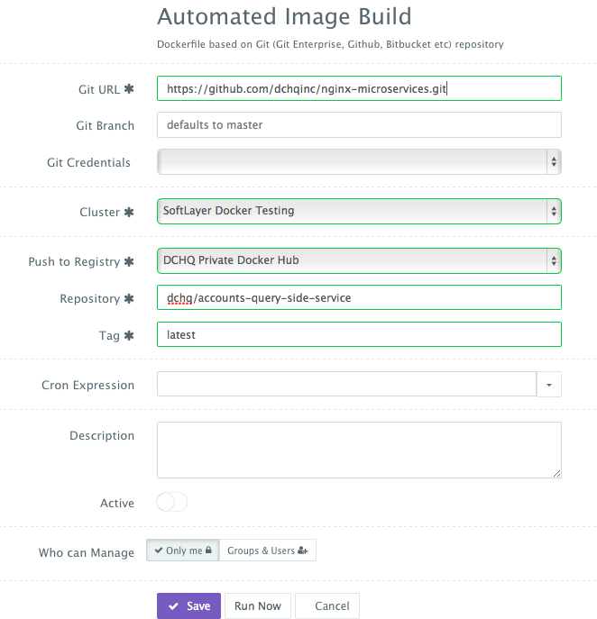

<figure>

</figure>

This is an extension of this project (https://github.com/cer/event-sourcing-examples). The project now provides a consolidated front-end that uses all of the microservices and can run on any web server. In this project, we use Nginx. The front-end provides the following capabilities:
-   **Create a new account using an initial balance**
-   **Query an account to get the remaining balance**
-   **Transfer money from one account to another**

The purpose of this project is to show how users can automate the deployment & management of this Docker Java Microservices application on any cloud or virtualization platform. 

To run & manage the **Event Sourcing Docker Java Microservices** application template in this project on 18 different clouds and virtualization platforms (including vSphere, OpenStack, AWS, Rackspace, Microsoft Azure, Google Compute Engine, DigitalOcean, IBM SoftLayer, etc.), make sure that you either:
-   **Sign Up for FREE on DCHQ.io** -- <http://dchq.io> (no credit card required), or
-   **Download DCHQ On-Premise Standard Edition for FREE** -- <http://dchq.co/dchq-on-premise-download.html>

**Table of Contents**  

- [DCHQ - Event Sourcing Docker Java Microservices ](#dchq---event-sourcing-docker-java-microservices-)
	- [Obtain credentials for the Event Store](#obtain-credentials-for-the-event-store)
	- [Applying a patch and building the JAR files](#applying-a-patch-and-building-the-jar-files)
	- [Automating the building of Docker images from Dockerfiles in this project using DCHQ](#automating-the-building-of-docker-images-from-dockerfiles-in-this-project-using-dchq)
	- [Building the YAML-based application templates that can re-used on any Linux host running anywhere](#building-the-yaml-based-application-templates-that-can-re-used-on-any-linux-host-running-anywhere)
		- [Event Sourcing Docker Java Microservices](#event-sourcing-docker-java-microservices)
 

DCHQ - Event Sourcing Docker Java Microservices 
===========================
<figure>

</figure>

 

Obtain credentials for the Event Store
---------------------------------------------------------------------------

In order to run the micro-services separately, you need to get credentials for the <a href="https://signup.eventuate.io">**Event Store**</a>

You will need copy and paste the obtained values for **EVENTUATE_API_KEY_ID** and **EVENTUATE_API_KEY_SECRET** in the <a href=#event-sourcing-docker-java-microservices>Event Sourcing Docker Java Microservices Application Template</a>

 

Applying a patch and building the JAR files
---------------------------------------------------------------------------

The JAR files used in the Docker images were built from this project: <a href="https://github.com/cer/event-sourcing-examples">https://github.com/cer/event-sourcing-examples</a>

All of the JAR files were built on December 27th, 2015 and embedded in the Docker images <a href="#automating-the-building-of-docker-images-from-dockerfiles-in-this-project-using-dchq">here</a>.

Before building the JAR files, please copy CORSFilter.java in the "event-sourcing-examples/java-spring/common-web/src/main/java/net/chrisrichardson/eventstore/javaexamples/banking/web/util" directory. You can then execute ./gradlew assemble.

~~~~~~~~~~~~~~~~~~~~~~~~~~~~~~~~~~~~~~~~~~~~~~~~~~~~~~~~~~~~~~~~~~~~~~~~~~~~~~~~
git clone https://github.com/cer/event-sourcing-examples.git

wget https://github.com/dchqinc/event-sourcing-microservices/raw/master/patch/CORSFilter.java -O /event-sourcing-examples/java-spring/common-web/src/main/java/net/chrisrichardson/eventstore/javaexamples/banking/web/util/CORSFilter.java

cd /event-sourcing-examples/java-spring

./gradlew assemble
~~~~~~~~~~~~~~~~~~~~~~~~~~~~~~~~~~~~~~~~~~~~~~~~~~~~~~~~~~~~~~~~~~~~~~~~~~~~~~~~

 

Automating the building of Docker images from Dockerfiles in this project using DCHQ
---------------------------------------------------------------------------

All of the images in this project have already been built and pushed to the DCHQ public Docker Hub repository. Here are the custom images that will be used in the application template:

-   **dchq/nginx-microservices:latest**
-   **dchq/accounts-command-side-service**
-   **dchq/transactions-command-side-service**
-   **dchq/transactions-command-side-service**-   

To build the images and push them into your own Docker Hub or Quay repository, you can use DCHQ. Here are the four GitHub projects used for these images:

-   <a href="https://github.com/dchqinc/accounts-command-side-service">https://github.com/dchqinc/accounts-command-side-service</a>
-   <a href="https://github.com/dchqinc/accounts-query-side-service">https://github.com/dchqinc/accounts-query-side-service</a>
-   <a href="https://github.com/dchqinc/transactions-command-side-service">https://github.com/dchqinc/transactions-command-side-service</a>
-   <a href="https://github.com/dchqinc/nginx-microservices">https://github.com/dchqinc/nginx-microservices</a>  

Once logged in to DCHQ (either the hosted DCHQ.io or on-premise version), a user can navigate to **Automate** > **Image Build** and then click on the **+** button to create a new **Dockerfile (Git/GitHub/BitBucket)** image build.

Provide the required values as follows:

-   **Git URL** – (e.g. https://github.com/dchqinc/nginx-microservices.git)

-   **Git Branch** – this field is optional -- but a user can specify a branch from a GitHub project. The default branch is master.

-   **Git Credentials** – a user can store the credentials to a private GitHub repository securely in DCHQ. This can be done by navigating to **Manage** > **Cloud Providers and Repos** and clicking on the **+** to select **Credentials**

-   **Cluster** – the building of Docker images is orchestrated through the DCHQ agent. As a result, a user needs to select a cluster on which an agent will be used to execute the building of Docker images. If a cluster has not been created yet, please refer to this <a href=#provisioning--auto-scaling-the-underlying-infrastructure-on-any-cloud>section</a> to either register already running hosts or automate the provisioning of new virtual infrastructure.

-   **Push to Registry** – a user can push the newly created image on either a public or private repository on Docker Hub or Quay. To register a Docker Hub or Quay account, a user should navigate to **Manage** > **Cloud Providers and Repos** and clicking on the **+** to select **Docker Registries**

-   **Repository** – this is the name of the repository on which the image will be pushed. For example, our image was pushed to **dchq/php-example:latest**

-   **Tag** – this is the tag name that you would like to give for the new image. The supported tag names in DCHQ include:
	
	- **{{date}}** -- formatted date
	
	- **{{timestamp}}** -- the full time-stamp

-   **Cron Expression** – a user can schedule the building of Docker images using out-of-box cron expressions. This facilitates daily and nightly builds for users.

Once the required fields are completed, a user can click **Save**.

A user can then click on the **Play Button** to build the Docker image on-demand.

<figure>

</figure>

 

Building the YAML-based application templates that can re-used on any Linux host running anywhere
-------------------------------------------------------------------------------------------------

 

### Event Sourcing Docker Java Microservices

~~~~~~~~~~~~~~~~~~~~~~~~~~~~~~~~~~~~~~~~~~~~~~~~~~~~~~~~~~~~~~~~~~~~~~~~~~~~~~~~
nginx:
  image: dchq/nginx-microservices:latest
  publish_all: true
  mem_min: 50m
  host: host1
  plugins:
    - !plugin
      id: Gl5Hi
      restart: true
      lifecycle: on_create
      arguments:
        - ACCOUNT_CMD_IP={{accountscommandside | ip}}
        - ACCOUNT_CMD_PORT={{accountscommandside | port_8080}}
        - ACCOUNT_TRANSFER_IP={{transactionscommandside | ip}}
        - ACCOUNT_TRANSFER_PORT={{transactionscommandside | port_8080}}
        - ACCOUNT_QUERY_IP={{accountsqueryside | ip}}
        - ACCOUNT_QUERY_PORT={{accountsqueryside | port_8080}}
    
accountscommandside:
  image: dchq/accounts-command-side-service
  mem_min: 300m
  cluster_size: 1
  host: host1
  publish_all: true
  environment:
    - EVENTUATE_API_KEY_ID=<paste-your-key-here>
    - EVENTUATE_API_KEY_SECRET=<paste-your-key-here>

transactionscommandside:
  image: dchq/transactions-command-side-service
  mem_min: 300m
  cluster_size: 1
  host: host1
  publish_all: true
  environment:
    - EVENTUATE_API_KEY_ID=<paste-your-key-here>
    - EVENTUATE_API_KEY_SECRET=<paste-your-key-here>
    
accountsqueryside:
  image: dchq/accounts-query-side-service
  mem_min: 300m
  cluster_size: 1
  host: host1
  publish_all: true
  environment:
    - EVENTUATE_API_KEY_ID=<paste-your-key-here>
    - EVENTUATE_API_KEY_SECRET=<paste-your-key-here>
    - SPRING_DATA_MONGODB_URI=mongodb://{{mongodb | container_private_ip}}/mydb

mongodb:
  image: mongo:3.0.4
  host: host1
~~~~~~~~~~~~~~~~~~~~~~~~~~~~~~~~~~~~~~~~~~~~~~~~~~~~~~~~~~~~~~~~~~~~~~~~~~~~~~~~

 

